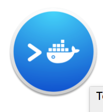
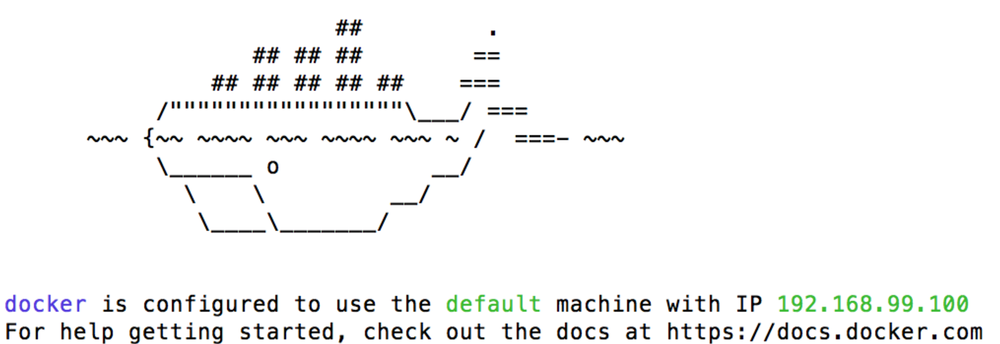

# TensorFlow tutorial

This codelab contains three lessons:

* Introduction to TensorFlow with Linear Regression
* MINST with Deep Learning
* Deepdream

These are all presented via [Jupyter](jupyter.org) notebooks.  To run
them on your machine, you will need a working TensorFlow installation (v0.10.0RC0). 

Below are instructions on how to set up a TensorFlow environment using Docker. 

## Setup

Docker runs your notebooks from a virtual machine.  Docker images already contain 
installed and compiled versions of TensorFlow.

Note: it’s quite possible to [install TensorFlow natively](https://tensorflow.org/get_started/os_setup.html) on your
machine (and this is recommended for long-term experimentation), but for
simplicity we have docmented only the Docker procedure here.

Prerequisites:
* A Mac or Ubuntu Linux machine (Docker will work on Windows, but the step-by-step instructions here may not work perfectly since we have not tried them)
* Some knowledge of Python

### Ubuntu Linux

The overall Linux setup commands for TensorFlow are [on
tensorflow.org](https://www.tensorflow.org/versions/r0.10/get_started/os_setup.html#docker-installation).

In summary, you will need to:

* Install Docker on your machine.
* Create a Docker group to allow launching containers without sudo.
* Launch a Docker container with the TensorFlow image.

You should check your installation by running:

```
docker run hello-world
```

To check TensorFlow, you can start a TensorFlow docker image by
running this:

```
docker run -it -p 8888:8888 tensorflow/tensorflow:0.10.0rc0 bash
```

Check to see if your TensorFlow works by invoking Python from the container’s command line (you’ll see `root@xxxxxxx#`):

```
# python

import tensorflow as tf
hello = tf.constant('Hello, TensorFlow!')
sess = tf.Session()
print(sess.run(hello))
```

If you see "Hello, Tensorflow", everything is in order.  You should
exit your docker instance (type `exit`), and go to the section ***Downloading This Repository**.

### Mac OS X:

If you already have the Docker Toolbox installed, skip to
"Installing/running a TensorFlow Docker Image." Otherwise, go to
[docs.docker.com/mac/](http://docs.docker.com/mac/) and follow the
instructions there, which should roughly be:

Download the Docker Toolbox. 
* On the Toolbox page, find the Mac version.
  * Download a DockerToolbox-1.xx.xx.pkg file (180MB).
  * Run that downloaded pkg to install the Toolbox.
  * At the end of the install process, choose the Docker Quickstart Terminal.
  * Open a terminal window and follow the installation script.
* If you have already installed Toolbox, just run the Docker Quickstart Terminal in `/Applications/Docker/`.
* Launch the **Docker Quickstart Terminal** 
  * This may take some time the first time to make an SSH connection.
* Run the suggested command in the terminal to confirm Docker
installation has worked:
```
docker run hello-world
```

#### Troubleshooting OS X

On OS X, you may see:

```
Error checking TLS connection: Something went wrong running an SSH command!
command : ip addr show
err     : exit status 255
```

At which point you may have to destroy and recreate your docker instance like so:

```
docker-machine rm default
docker-machine create --driver virtualbox default
```

#### Installing and Running the TensorFlow Image

On OS X, if you have not already, run the Docker Quickstart Terminal,
usually found in `/Applications/Docker`, and which looks like this:



There will be a long pause as the Docker container starts and gets an
SSH keys and an IP address.

Once you see an ASCII whale in the newly-opened terminal, run this command:

```
docker run -it tensorflow/tensorflow:0.10.0rc0 bash
```

Check to see if your TensorFlow works by invoking Python from the container’s command line (you’ll see `root@xxxxxxx#`):

```
# python

import tensorflow as tf
hello = tf.constant('Hello, TensorFlow!')
sess = tf.Session()
print(sess.run(hello))
```

If you see "Hello, Tensorflow!", it works!

#### Running Faster on OS X

Training takes a long time, even a limited run like this. It helps to
provide a lot of CPU and memory resources if you can.

On OS X, these Docker instances are running on VirtualBox, and
VirtualBox by default doesn’t take over huge parts of your
computer. TensorFlow will take a lot of resources, so it’s worth
increasing the resources allocated to it.

* Find VirtualBox in your Application folder, and open it.
* Stop the running process, if there is one
  * Right-click on “Default” and choose Stop -> Close ACPI Shutdown
* Click on Settings, then System
* Choose Motherboard and boost the RAM to the edge of the green area. 
* Click on Processor, and, again, boost that to the edge of the green area.
* Click OK.
* Restart the VirtualBox instance by right-clicking on “default” and choosing **Start -> Headless Start**, then wait a bit until it's Running.
* Re-run the **Docker Quickstart Terminal**.

* Your session will have ended.  Optionally, you can verify that the Docker image still works:

```
docker run hello-world
```

## Downloading This Repository

This is not rocket science, but do keep track of where you've
installed this.

```
git clone https://github.com/martinwicke/tensorflow-tutorial.git $HOME/tensorflow-tutorial
```

## Run Docker with Jupyter and TensorBoard

Note: On Mac OS X, if you have not already opened a **Docker
Quickstart Terminal**, you must do so now.

Go to where you cloned the repository (we're assuming `$HOME`):

```
cd $HOME
docker run  -v $HOME/tensorflow-tutorial:/tutorial -p 0.0.0.0:6006:6006 -p 0.0.0.0:8888:8888 -it tensorflow/tensorflow:0.10.0rc0 bash
```

This will start a Docker instance with the tutorial materials mounted
at `/tutorial`.

*(Note: All further commands are run in the Docker
image, so your prompt will be `root@[something]#`).*

Once started, run the Jupyter server in the right directory.

```
cd /tutorial
/run_jupyter.sh &
```

You will also want to run TensorBoard:

```
tensorboard --logdir=`pwd` &
```

**On Linux**:  You can navigate to:

* [http://localhost:8888](http://localhost:8888)


**On OSX:** You can navigate to:

* [http://192.168.100.99:8888](http://192.168.100.99:8888)

or whichever local address your VM has on your machine.

TensorBoard is available in a similar place, either [http://localhost:6006](http://localhost:6006) or
[http://192.168.100.99:6006](http://192.168.100.99:6006) on MacOS.

On OS X, you can find the exact address under the whale where you
started your terminal, shown here:



## When You're Done

To exit Docker, you can simply enter `exit` or hit `Ctrl-D`.


